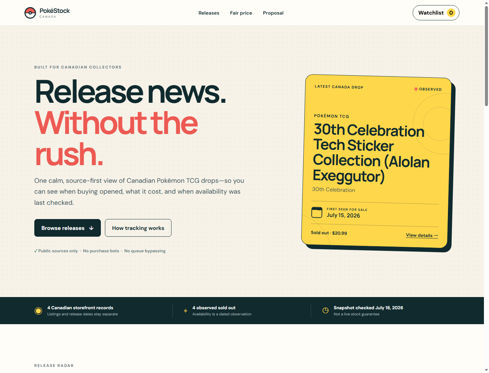

# PokéStock Canada

PokéStock Canada is a Canada-first proof of concept for finding official Pokémon TCG releases and understanding whether a public price is close to the official Canadian reference price.

The project is intentionally **information-only**. It does not automate purchases, bypass queues, defeat retailer protections, or guarantee inventory.



## What the POC does

- Runs a source-to-alert release radar: permitted inputs → normalized signals → confidence scoring → watch-state changes.
- Separately scores product existence, Canadian relevance, and timing instead of inventing preorder dates.
- Shows an evidence timeline through Early watch, Product confirmed, Prepare, Live now, and Sold out/restock watch.
- Presents Canadian storefront drops and official product releases in one feed without treating them as the same event.
- Links every release claim to a first-party source.
- Filters by release state, product type, and search term.
- Shows first-seen storefront dates, dated availability, and official launch dates.
- Stores a personal watchlist in the browser.
- Classifies offers against a Canadian reference price when both values are available.
- Clearly distinguishes verified information from unavailable or pending information.

The initial catalog is a dated, manually verified storefront snapshot—not a live stock feed. Every availability label includes its check date. See [MONITORING.md](MONITORING.md) for the path toward responsible automation and [PROPOSAL.md](PROPOSAL.md) for the broader roadmap.

## Run locally

Requirements: Node.js 20 or newer.

```bash
npm start
```

Open `http://localhost:4173`. The included development server uses only Node.js; alternatively, any static HTTP server can serve this directory.

## Verify

```bash
npm test
npm run check:data
```

There are no runtime dependencies and no build step. `index.html` is directly deployable to GitHub Pages.

## Run the release radar

```bash
npm run pipeline
npm run check:data
npm run notify
```

The default connectors read the curated, source-linked records in `data/feeds/`. Optional remote JSON Feed, RSS, or Atom URLs can be supplied through `POKESTOCK_FEED_URLS` only when the publisher permits automated retrieval. The pipeline writes normalized evidence to `data/signals.json` and website-ready watch states to `data/radar.json`.

Notifications are change-only. Configure `DISCORD_WEBHOOK_URL` for Discord, or `RESEND_API_KEY`, `ALERT_EMAIL_FROM`, and `ALERT_EMAIL_TO` for email. With no secrets, notification delivery safely skips.

The scheduled `radar.yml` GitHub Action runs at minutes 17 and 47 each hour, validates the output, sends any new actionable alert, and commits website data only when the signal state changes.

## Deploy to GitHub Pages

1. Create a new GitHub repository.
2. Copy this folder into the repository root and push it.
3. In GitHub, open **Settings → Pages** and select **GitHub Actions** as the source.
4. The included workflow validates and deploys the site on pushes to `main`.

## Catalog editing

Edit `data/products.json`. Each record must include a unique ID, official source, release date, verification timestamp, and Canadian availability scope. Run `npm run check:data` before committing.

Prices should be recorded only when a public Canadian source supports them. Use `null` when the price is not known. Record `firstSeenAt` separately from `releaseDate`, and always pair an availability status with `checkedAt`. Never infer CAD prices from US pricing.

## Project layout

```text
.
├── .github/workflows/   # CI and GitHub Pages deployment
├── data/products.json   # Curated POC catalog
├── data/feeds/          # Curated/permitted signal inputs
├── data/signals.json    # Normalized evidence generated by the pipeline
├── data/radar.json      # Website-ready confidence and watch states
├── config/sources.json  # Explicit source and permission configuration
├── src/                 # UI and reusable catalog logic
├── tests/               # Node test suite
├── index.html
├── styles.css
├── PROPOSAL.md
├── MONITORING.md
└── README.md
```

## Trademark notice

This is an independent fan project. Pokémon, Pokémon TCG, and related names are trademarks of their respective owners. This project is not affiliated with, sponsored by, or endorsed by The Pokémon Company International.
