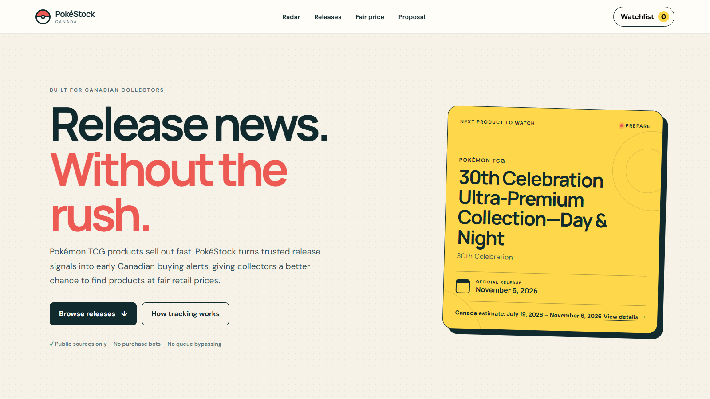
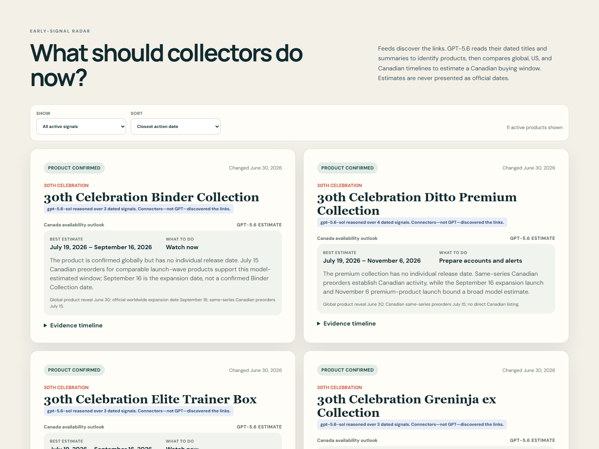

# PokéStock Canada



**Canadian collectors: catch fair-price Pokémon TCG drops before sellout. Source-linked forecasts and availability alerts.**

PokéStock Canada is a Canada-first release intelligence proof of concept. It turns official news, permitted feeds, and dated Canadian storefront observations into early product warnings, Canada-focused buying outlooks, and an auditable history of what was available at retail price.

The project is intentionally **information-only**. It does not automate purchases, bypass queues, defeat retailer protections, or guarantee inventory.

## What the POC does

- Runs a source-to-alert release radar: permitted inputs → optional GPT-5.6 normalization and reasoning → deterministic validation → watch-state changes.
- Estimates a Canadian buying window from official/global dates, Canadian retail signals, and comparable same-series launches while keeping estimates separate from confirmed dates.
- Starts the Release radar when official news confirms a product, then tracks Product confirmed, Prepare, Live now, and explicit Restock watch states.
- Presents Canadian storefront drops and official product releases in one feed without treating them as the same event.
- Links every release claim to its evidence source and labels first-party and permitted-discovery evidence separately.
- Filters by release state, product type, and search term.
- Shows first-seen storefront dates, dated availability, and official launch dates.
- Stores a personal watchlist in the browser.
- Classifies offers against a Canadian reference price when both values are available.
- Clearly distinguishes verified information from unavailable or pending information.

The cold-start catalog contains four 30th Celebration products observed on Pokémon Center Canada on July 15, 2026, plus the completed Mega Evolution—Pitch Black Canadian launch. It is a dated, manually verified storefront snapshot—not a live stock feed. Every availability label includes its check date. See [MONITORING.md](MONITORING.md) for the path toward responsible automation and [PROPOSAL.md](PROPOSAL.md) for the broader roadmap.

## Image gallery

| Release radar | Canadian availability record |
| --- | --- |
|  |  |

A full-page capture is available at [docs/images/full-dashboard.png](docs/images/full-dashboard.png). These images are captured from the running application and can be uploaded directly to a GitHub README or Devpost image gallery.

## Demo video

The 2:49 [frame-synchronized 2K walkthrough](docs/demo/pokestock-canada-demo-2k.mp4) is the recommended submission video. Its ten scenes are rendered natively at 2560×1440 and change 0.55 seconds after the final spoken word. The clean [visual deck](docs/demo/pokestock-demo.pptx), [narration script](docs/demo/DEMO_SCRIPT.md), [storyboard](docs/demo/DEMO_STORYBOARD.md), [subtitle file](docs/demo/pokestock-demo.srt), and [upload copy](docs/demo/VIDEO_UPLOAD.md) are also included.

## Optional GPT-5.6 release intelligence

Curated records already have a verified structure and do not need an AI call. Built-in public RSS/Atom discovery feeds cover release-news reposts and the official Pokémon YouTube channel; additional permitted feeds can be configured. A deterministic keyword filter removes non-TCG and non-release posts. When a developer explicitly enables the local GPT mode, GPT-5.6 extracts every named product and variant, region, event type, dates explicitly present in the source, and the appropriate collector action using a strict JSON schema.

Deterministic application code remains authoritative: it validates every GPT result, calculates evidence strength, advances watch states, and sends notifications. The prompt explicitly forbids invented dates, prices, Canadian relevance, and availability. Previously interpreted publications are cached by a content fingerprint, so an unchanged feed item is not billed again.

The UI uses a second cached GPT-5.6 pass for Canada availability outlooks. It compares official/global dates, Canadian retailer signals, and dated same-series examples to produce a best-estimate buying window and action. The output is always labeled as a model estimate; an official release date remains a separate field. Feed connectors discover every URL—GPT does not browse for or invent source links.

The public GitHub workflow intentionally receives **no OpenAI API key** and cannot consume API credits. Checked-in cache records let the POC demonstrate previously generated structured interpretations and outlooks. New GPT analysis is local and opt-in only.

Configure the pipeline environment:

- `OPENAI_API_KEY`: optional for local GPT experiments only; never exposed to GitHub Pages or the scheduled GitHub workflow.
- `POKESTOCK_FEED_URLS`: optional comma-separated permitted RSS, Atom, or JSON feeds in addition to the built-in discovery feeds.
- `OPENAI_MODEL`: optional local override; it defaults to the `gpt-5.6` alias.

Test one source record locally without changing website data:

```bash
npm run demo:gpt -- data/demo-publication.json
```

Without `OPENAI_API_KEY`, curated inputs still run and unstructured items fail closed with a clear skip message. Tests use a mocked API response and never consume API credits.

## Run locally

Requirements: Node.js 20 or newer.

```bash
npm start
```

Open `http://localhost:4173`. The included development server uses only Node.js; alternatively, any static HTTP server can serve this directory.

## Verify

```bash
npm test
npm run check:data
```

There are no runtime dependencies and no build step. `index.html` is directly deployable to GitHub Pages.

## Run the release radar

```bash
npm run pipeline
npm run check:data
npm run notify
```

The default connectors read curated, source-linked records in `data/feeds/` plus the public feeds declared in `config/sources.json`. Optional remote JSON Feed, RSS, or Atom URLs can be supplied through `POKESTOCK_FEED_URLS` only when the publisher permits automated retrieval. Feed failures are isolated, unchanged publications are served from the GPT fingerprint cache, and only Canada-specific stock evidence can trigger `Live now` or `Sold out`. The pipeline writes normalized evidence to `data/signals.json` and website-ready watch states to `data/radar.json`.

Notifications are change-only. Configure `DISCORD_WEBHOOK_URL` for Discord, or `RESEND_API_KEY`, `ALERT_EMAIL_FROM`, and `ALERT_EMAIL_TO` for email. With no secrets, notification delivery safely skips.

The scheduled `radar.yml` GitHub Action runs at minutes 17 and 47 each hour, processes curated and permitted structured evidence, validates the output, sends any new actionable alert, and commits website data only when the signal state changes. It does not receive `OPENAI_API_KEY`; unstructured items that lack a cached interpretation fail closed without an API call.

## Deploy to GitHub Pages

1. Create a new GitHub repository.
2. Copy this folder into the repository root and push it.
3. In GitHub, open **Settings → Pages** and select **GitHub Actions** as the source.
4. The included workflow validates and deploys the site on pushes to `main`.

## Catalog editing

Edit `data/products.json`. Each record must include a unique ID, official source, release date, verification timestamp, and Canadian availability scope. Run `npm run check:data` before committing.

Prices should be recorded only when a public Canadian source supports them. Use `null` when the price is not known. Record `firstSeenAt` separately from `releaseDate`, and always pair an availability status with `checkedAt`. Never infer CAD prices from US pricing.

Evidence labels (`Low`, `Medium`, `High`) describe the strength and specificity of linked sources. They are not statistical probabilities. For example, `High timing evidence` on a sold-out product means its past storefront state was directly observed; it does not mean there is a 90% probability of a future live date.

## Project layout

```text
.
├── .github/workflows/   # CI and GitHub Pages deployment
├── data/products.json   # Curated POC catalog
├── data/feeds/          # Curated/permitted signal inputs
├── data/signals.json    # Normalized evidence generated by the pipeline
├── data/radar.json      # Website-ready evidence strength and watch states
├── data/gpt-cache.json  # Fingerprint cache for interpreted feed records
├── config/sources.json  # Explicit source and permission configuration
├── docs/images/         # GitHub and Devpost banner/gallery captures
├── docs/demo/           # Demo video, editable deck, script, captions, and upload copy
├── src/                 # UI and reusable catalog logic
├── tests/               # Node test suite
├── index.html
├── styles.css
├── PROPOSAL.md
├── MONITORING.md
├── DEVPOST_SUBMISSION.md
└── README.md
```

## Trademark notice

This is an independent fan project. Pokémon, Pokémon TCG, and related names are trademarks of their respective owners. This project is not affiliated with, sponsored by, or endorsed by The Pokémon Company International.
